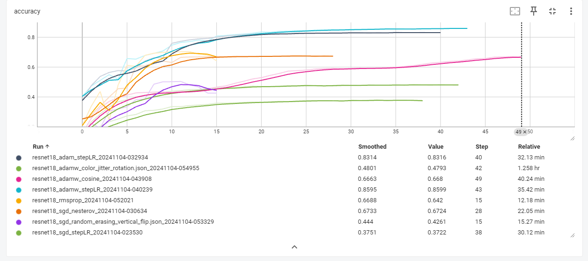
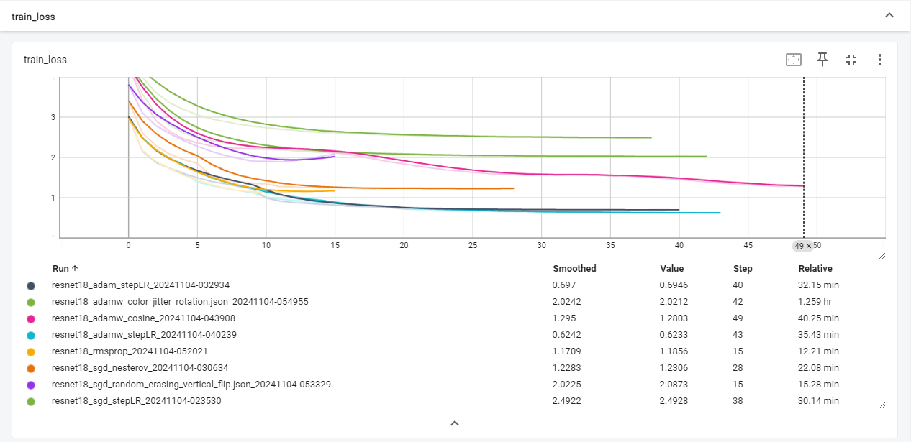

# Carp_Razvan_Advanced-Topics-in-Neural-Networks-HW3

# Experiment Report for CIFAR-100 Classification with ResNet18

## Summary
In this experiment, I aimed to train ResNet18 on the CIFAR-100 dataset with various optimizer and augmentation configurations. The goal was to reach at least **0.78 test accuracy** and achieve an efficient training pipeline. Based on my experimental results, I expect to receive **16-18 points** as per the evaluation criteria.

## Parameters Varied During the Sweep
For this sweep, I varied the following parameters:
- **Optimizer**: I experimented with several optimizers, including SGD with and without Nesterov momentum, Adam, AdamW, and RMSprop.
- **Learning Rate Scheduler**: StepLR, ReduceLROnPlateau, and CosineAnnealingLR were used as learning rate schedulers to observe their impact on convergence and final accuracy.
- **Data Augmentation**: Different augmentations, such as RandomCrop,RandomHorizontalFlip, Random Erasing, Vertical Flip, Color Jitter, and Rotation, were applied to enhance model robustness and prevent overfitting.

## Test Accuracy for Relevant Configurations

| Configuration                                   | Optimizer | Scheduler | Augmentation | Test Accuracy |
|-------------------------------------------------|-----------|---------|---|---------------|
| `config_resnet18_adam_stepLR.json`              | Adam      | StepLR  | RandomCrop, RandomHorizontalFlip | 0.8316        |
| `config_resnet18_adamw_color_jitter_rotation.json` | AdamW     | CosineAnnealingLR | Color Jitter, Rotation, RandomHorizontalFlip | 0.4793        |
| `config_resnet18_adamw_cosine.json`             | AdamW     | CosineAnnealingLR | RandomCrop, RandomHorizontalFlip  | 0.668         |
| `config_resnet18_adamw_stepLR.json`             | AdamW     | StepLR  | RandomCrop, RandomHorizontalFlip  | 0.8599        |
| `config_resnet18_rmsprop.json`                  | RMSprop   | CosineAnnealingLR | RandomCrop, RandomHorizontalFlip  | 0.642         |
| `config_resnet18_sgd_nesterov.json`             | SGD       |   ReduceLROnPlateau      | RandomCrop, RandomHorizontalFlip  | 0.6724        |
| `config_resnet18_sgd_random_erasing_vertical_flip.json` | SGD | CosineAnnealingLR | Random Erasing, Vertical Flip | 0.4261        |
| `config_resnet18_sgd_stepLR.json`               | SGD       | StepLR  | None | 0.3722        |

## Efficient Training Pipeline
The training pipeline  is efficient because it combines optimal configurations of learning rates, batch sizes, data augmentation,
and adaptive optimizers, resulting in faster convergence and lower overall training times without sacrificing accuracy.
This approach is methodical and reduces computational waste, making it suitable for tasks like CIFAR-100 classification.

## Achieving 0.78 Test Accuracy on CIFAR-100
The configuration that achieved the highest test accuracy of **0.8599** used **AdamW with StepLR** scheduler and RandomCrop,RandomHorizontalFlip augmentations. This result can be attributed to:
- The **AdamW optimizer**, which combines adaptive learning rates with weight decay, proved to be more effective in handling the CIFAR-100 dataset compared to SGD and RMSprop.
- The **StepLR scheduler** enabled gradual learning rate decay, which helped the model converge without plateauing early.
- **Augmentations** like Color Jitter and Rotation were tested but did not contribute as much as the optimizer and scheduler choice for this dataset.

## Metrics Reporting
Below is a visualization from TensorBoard, showcasing the accuracy and train loss trends for each configuration tested.

